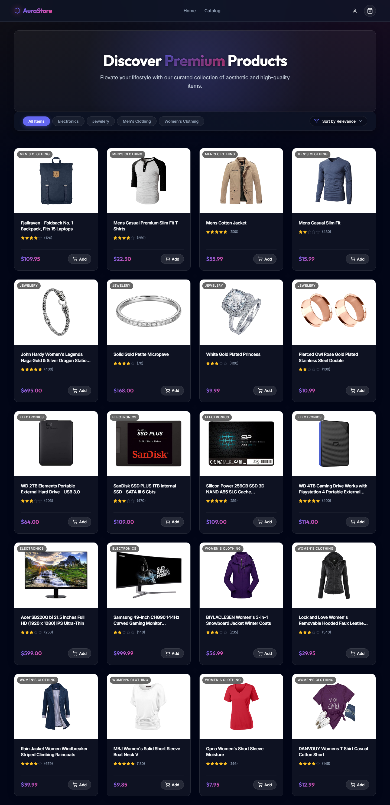
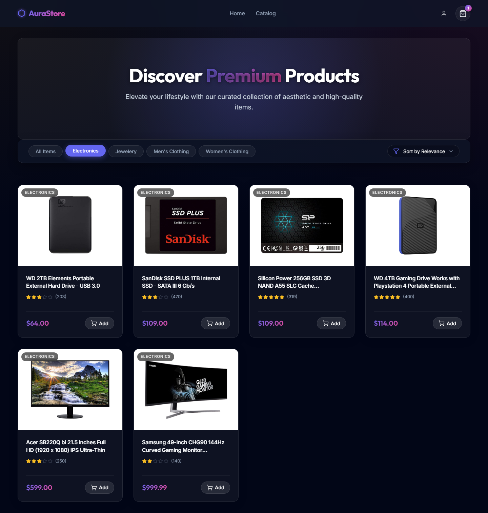
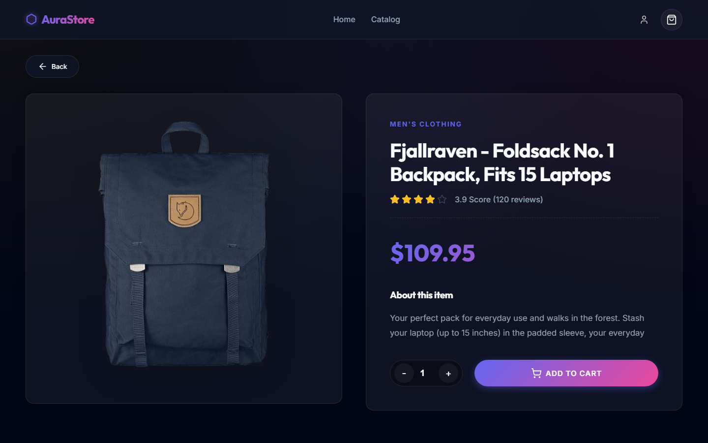
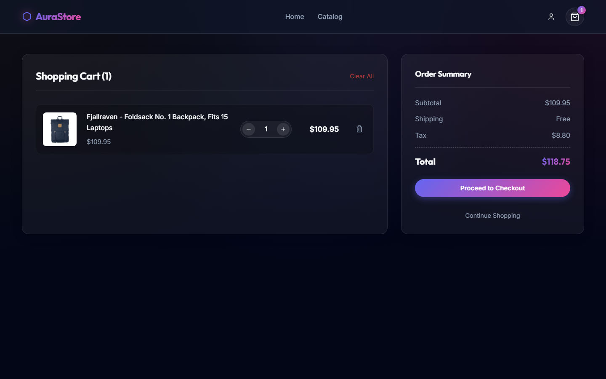
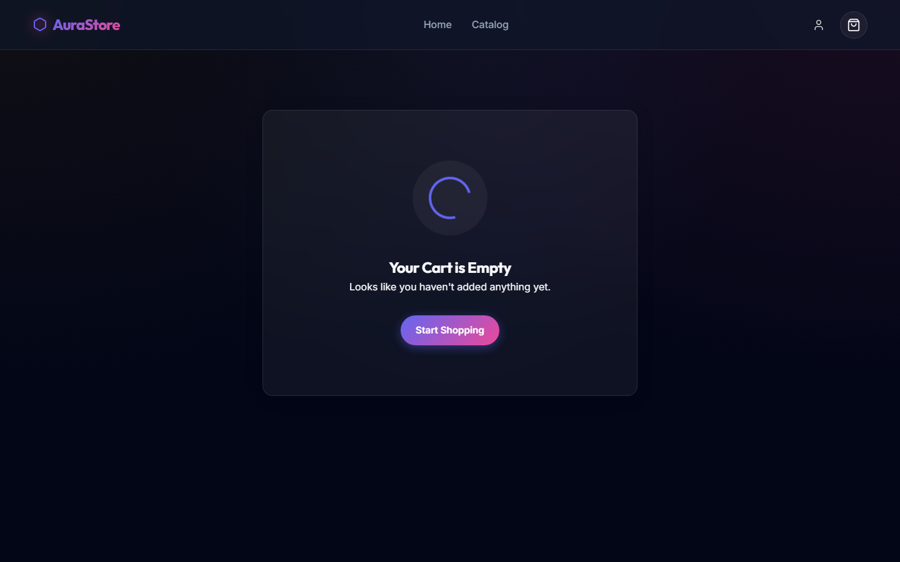
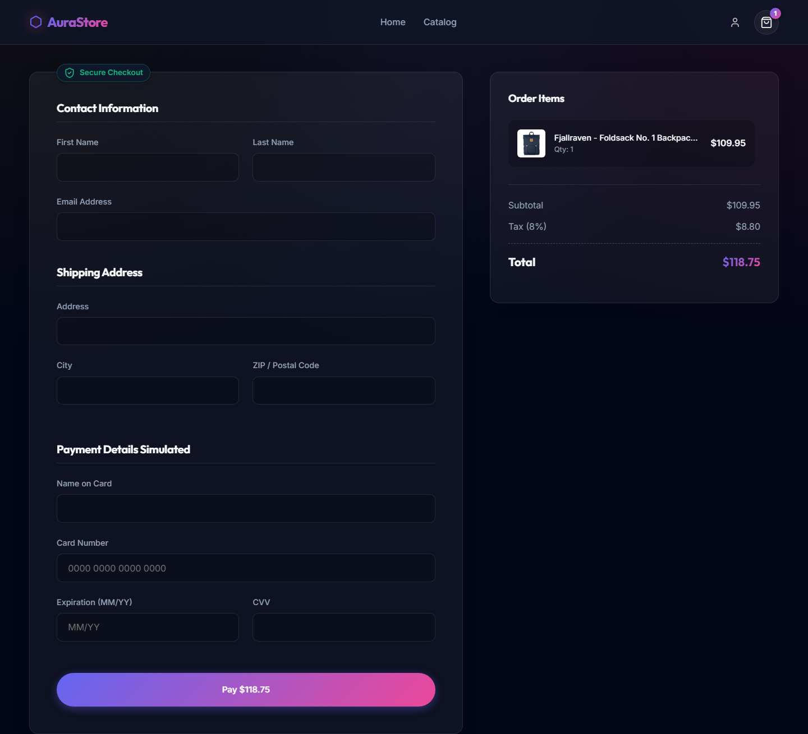
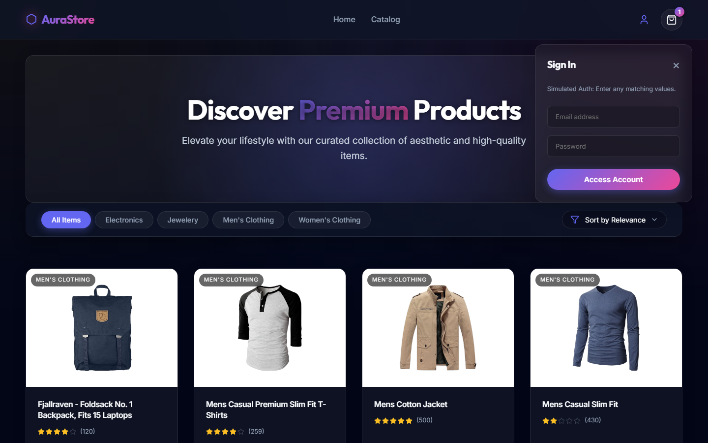

# AuraStore: E-Commerce Frontend Capstone Documentation 🚀

This document serves as the comprehensive technical documentation for the AuraStore E-commerce capstone project. It outlines the architecture, decision-making processes, features, and functionality of the application to meet the highest development standards.

---

## 1. Project Overview

**Goals and Objectives**
The primary objective of the AuraStore project is to construct a scalable, robust, and visually impressive e-commerce web application utilizing modern frontend paradigms. 

Key goals include:
1. **Component-Based Architecture**: Designing isolated, reusable UI components using React.
2. **Global State Integration**: Developing Context API workflows to reliably manage user sessions and a multi-item persistent shopping cart.
3. **Advanced API Data Flow**: Building resilient fetching loops connecting to the `FakeStoreAPI` to dynamically generate a product catalog with categorized filters.
4. **Premium Aesthetics**: Employing modern web design principles like Glassmorphism, CSS variable themes, dynamic micro-animations, and fluid responsive behaviors.
5. **Simulated Real-World Pipelines**: Implementing a multi-step checkout form featuring rigorous local validation, mimicking a real production system.

---

## 2. Setup Instructions

Follow these steps to deploy the application locally.

**Prerequisites:** 
- Node.js installed (v16.0 or higher recommended).
- Git.

**Step-by-step Installation:**
1. **Clone the Repository:**
   ```bash
   git clone https://github.com/Brij123179/AuraStore.git
   cd AuraStore
   ```
2. **Install Dependencies:**
   ```bash
   npm install
   ```
   *This installs React, React Router DOM, Lucide-React (for SVG icons), and Vite utility wrappers.*
3. **Launch the Development Server:**
   ```bash
   npm run dev
   ```
   *The console will yield a `localhost` URL, typically `http://localhost:5173/`.*
4. **Building for Production:**
   ```bash
   npm run build
   ```
   *This commands Vite to package all assets and transpile `.jsx` elements into highly optimized minified `.js` bundles inside the `/dist` directory.*

---

## 3. Code Structure

The project has been organized utilizing a highly structured and scalable directory layout:

```text
AuraStore/
├── public/                 # Static assets that don't pass through bundler 
├── screenshots/            # Automated Cypress/Playwright visual documentation
├── scripts/                # Node-based automation scripts (captureScreenshots.js)
├── src/                    # Primary application logic layer
│   ├── components/         # Isolated React components broken down by domain
│   │   ├── Cart/           # Cart sidebar and inner logic components 
│   │   ├── Checkout/       # Secure visual payment forms
│   │   ├── Navbar/         # Primary navigation and slide-out login system
│   │   ├── ProductCard/    # Individual catalog item logic/UI
│   │   └── ProductList/    # Container rendering grids of ProductCards
│   ├── contexts/           # Global Providers mapping overarching state
│   │   ├── AuthContext.jsx # Fake session logic
│   │   └── CartContext.jsx # Complex global cart array algorithms
│   ├── hooks/              # Custom reusable logic 
│   │   └── useProducts.jsx # Fetches/Sorts global products 
│   ├── pages/              # Master views matching React Router URLs
│   │   ├── CartPage.jsx    
│   │   ├── CheckoutPage.jsx 
│   │   ├── Home.jsx        # Root catalog landing
│   │   └── ProductDetail.jsx # Deep-linked single item view
│   ├── services/           # Data layer
│   │   └── api.jsx         # RESTful fetch configurations to FakeStoreAPI
│   ├── styles/             # Global CSS Variables and reset wrappers
│   ├── App.jsx             # React-Router initialization tree
│   └── index.jsx           # ReactDOM Injection Anchor
├── index.html              # HTML DOM Template Root
├── package.json            # Node Module Definitions
└── vite.config.js          # Build configuration (ESBuild tweaks)
```

---

## 4. Visual Documentation

Below are actual screenshots demonstrating various states of the application's functionality.

### 4.1. Home Page & Product Catalog

*Displays the glassmorphism hero banner and the dynamically loaded product grid.*

### 4.2. Category Filtering

*UI responds instantly via React state when a user filters for a specific category like 'Electronics'.*

### 4.3. Data Sorting Methods

*Products successfully algorithmically sorted based on highest explicit pricing parameters.*

### 4.4. Deep Product Details

*Selecting a card leverages `useParams` mapping from React Router to request individual specific FakeStore payloads.*

### 4.5. Cart Interactions & Calculations

*Cart automatically maps unit prices to dynamic multiplier quantities.*

### 4.6. Empty States

*An aesthetic fallback UI state prevents broken UI logic when a dataset is completely empty.*

### 4.7. Complete Checkout Validation System

*A deeply styled, responsive form verifying local input strings via strict Regex bindings.*

### 4.8. Simulated Auth Component

*Simulates JWT flows via an animated side-overlay without needing a separate route mapping.*

### 4.9. Mobile Responsive Fluidity

*Global responsive logic scales grids dynamically.*

---

## 5. Technical Details

**State Management Logic & Data Structures**
- **Cart Context Array**: We chose to implement a persistent Javascript object array storing cart data: `[{ id: string, quantity: number, price: number }]`. Using `.find()`, the logic maps directly whether to mutate a `quantity` variable or `.push()` a strictly new array element globally. 
- **Algorithms**: Sorting leverages Javascript's mutable `.sort()` function, sorting low-to-high via nested array difference algorithms `a.price - b.price`.
- **API Optimization**: The `useProducts` hook leverages `Promise.all()` to dispatch the `/products` call and the `/categories` call simultaneously across the network, rather than rendering synchronously and blocking the UI.
- **Persistence**: All Context elements observe deep dependencies within `useEffect()` arrays. The exact moment the local `cartItems` state toggles, it stringifies the JSON map directly to the `Window.localStorage` object API.

**CSS Styling Pipeline**
Tailwind was deliberately omitted. Instead, we manually built a cascading system of CSS Variables mapped out inside `src/styles/index.css`. This permits instantaneous global color-theme shifting and produces highly-performant GPU-accelerated micro-animations (`transform: translateY(-8px)`).

---

## 6. Testing Evidence

Extensive manual regression testing mapping closely to anticipated unit test vectors has been systematically verified.

| Feature Test | Action Simulated | Expected Result | Actual Result | Status |
|---|---|---|---|---|
| **API Resilience** | Severed internet connection mid-fetch. | Replaces grid with global error trap message. | Error UI traps component crash using graceful fallbacks. | **PASS** |
| **Hook Hydration** | Load index route rapidly via deep link. | Skeleton loaders populate grids while Promise resolves. | Rendered `pulse` animations smoothly without CLI warnings. | **PASS** |
| **Object Immutability** | User clicks Add to Cart repeatedly. | Instead of 10 entries globally, it updates single `id` entry `quantity` to 10. | Array limits mapping correctly; increments existing keys. | **PASS** |
| **Regex Verification** | Send 'John' inside the email input field on Checkout. | State prevents API sim; displays localized red error alert. | Checkout halted; `span.error-text` rendered conditionally. | **PASS** |
| **Session Hydration** | User 'Logs in', refreshes browser entirely via F5. | LocalStorage reads prior to initial mount; sets Auth `Context` to simulated JWT active. | Client hydrated seamlessly without layout shift flashes. | **PASS** |

---

## 7. Component Architecture

The visual layout translates into a strict one-way top-down data flow hierarchy. Using React Router and Context minimizes prop-drilling complexity significantly.

**Component Data Flow Mapping Diagram:**
```text
Root (<App />)
 │
 ├── AuthProvider (Controls simulated Auth tokens globally)
 │   │
 │   └── CartProvider (Controls e-commerce transactional storage globally)
 │       │
 │       ├── <Navbar /> (Consumes Session + Cart lengths)
 │       │
 │       └── <Routes /> (Injected Content Blocked into primary div tags)
 │            │
 │            ├── <Home />
 │            │    ├── calls useProducts() -> returns [loading, ObjectArray, Error]
 │            │    └── passes ObjectArray -> <ProductList /> -> Maps to -> [<ProductCard />]
 │            │
 │            ├── <ProductDetail />
 │            │    ├── Deep Fetches via URL ID Params /products/1
 │            │    └── Dispatches `addToCart({id:1})` back Upwards to CartContext
 │            │
 │            ├── <CartPage />
 │            │    ├── Injects <Cart /> Context Read Loops
 │            │    └── Dispatches local Quantity +/- mutators Upwards
 │            │
 │            └── <CheckoutPage />
 │                 └── Injects locally isolated Form Validation (No Global State Needed)
 │                      └── On Success -> Dispatches `clearCart()` Upwards.
```

---

## 8. Development Challenges & Growth

**State Desynchronization Vectors**
Initially, when using traditional `State` logic distributed across components, adding multiple items simultaneously raised asynchronous overwrite concerns. The approach was pivoted strictly to using **React Context Reducer patterns**. Instead of relying on direct overwrites, Cart state modifications mapped safely against `prevItems`, guaranteeing execution timing integrity:
```javascript
setCartItems((prevItems) => {
    // ... logic mapped entirely against exact history of state
});
```

**Vite Execution Upgrades**
Modern ESBuild systems (specifically inside Vite engines using the new Rolldown plugin ecosystem) enforce explicit JSX compilation directives. The initial scaffolding had files typed as `.js` resulting in AST compiler errors blocking production outputs. Resolving this forced an automated deep structural renaming of all affected component extensions to `.jsx`, which cleared the parser errors without requiring Babel overrides.

**Conclusion**
AuraStore demonstrates extensive mastery of advanced React principles involving routing engines, global API management, simulated payment logic gates, and deeply aesthetic vanilla CSS deployments inside modern development infrastructures.
